# 2019.09.25 PHP 리포트

수업내용정리

## -1-
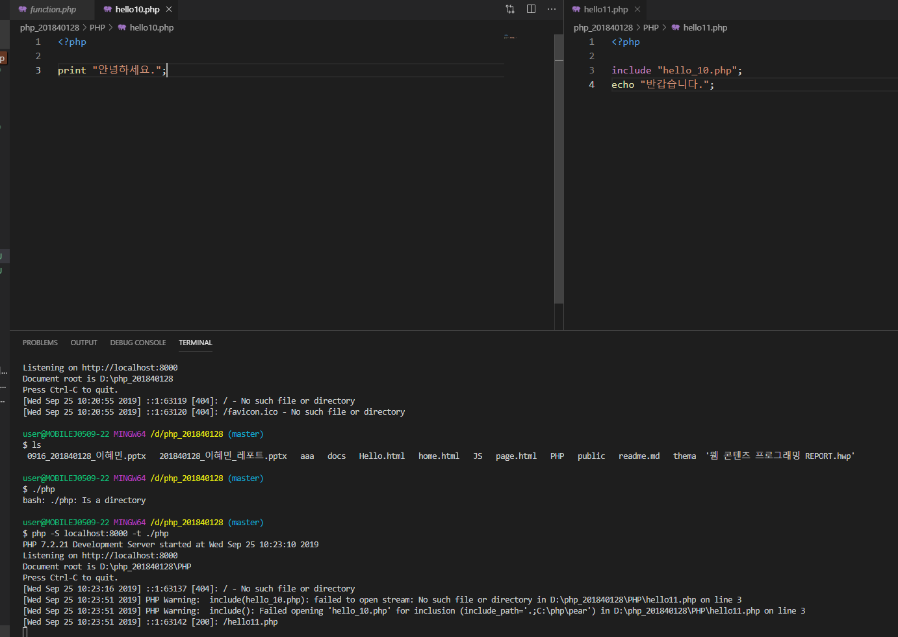
localhost가 not found로 나오는 이유

## -2-
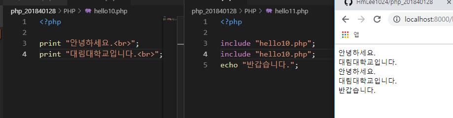
include 소스가 몇줄이 되었든 다 집어 넣는다.

## -3-

오류제어연산자 include 오류가나도 실행됨

## -4-
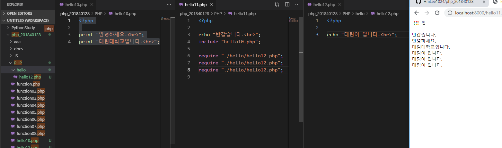
require 경로지정

## -5-

require 파일경로가 달라도 실행중단됨

## -6-
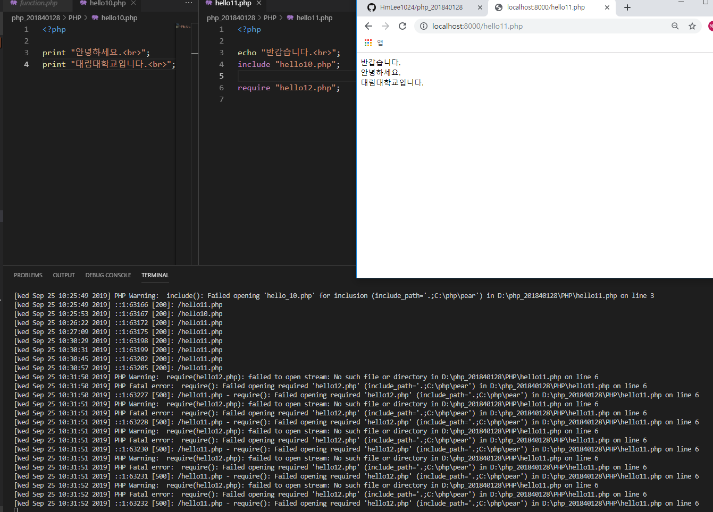
4_require 파일이 없으면 실행이 중단된다. Falid 됨

## -7-
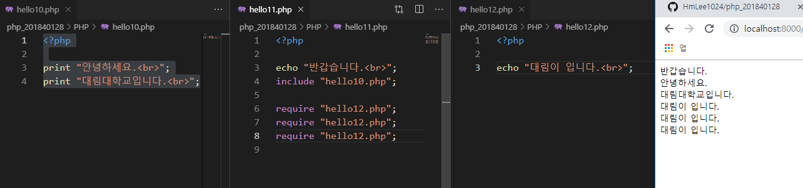
require 파일이있으면 실행

## -8-
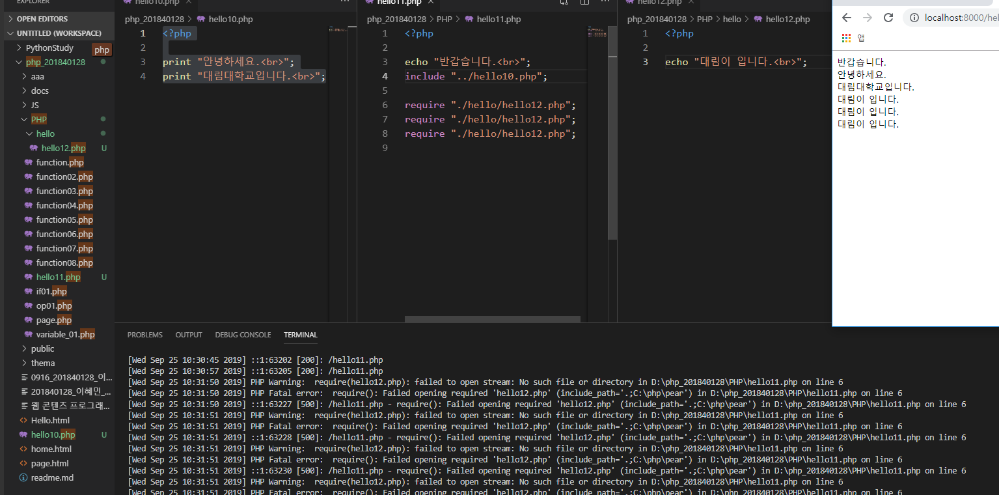
경로지정 한다.

## -9-
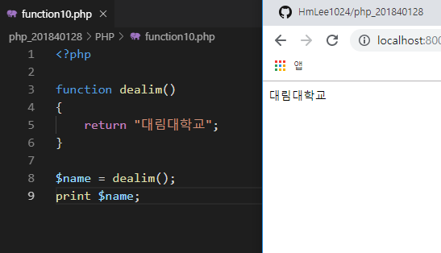
return으로 값 저장시키고 출력

## -10-
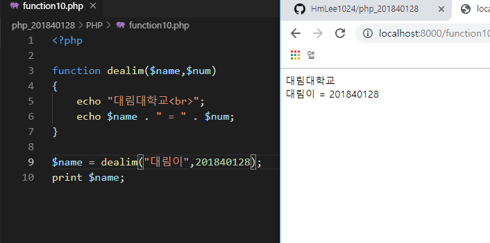
변수값 출력

## -11-
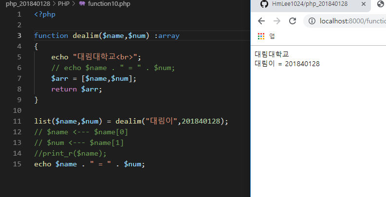
변수타입지정

## -12-
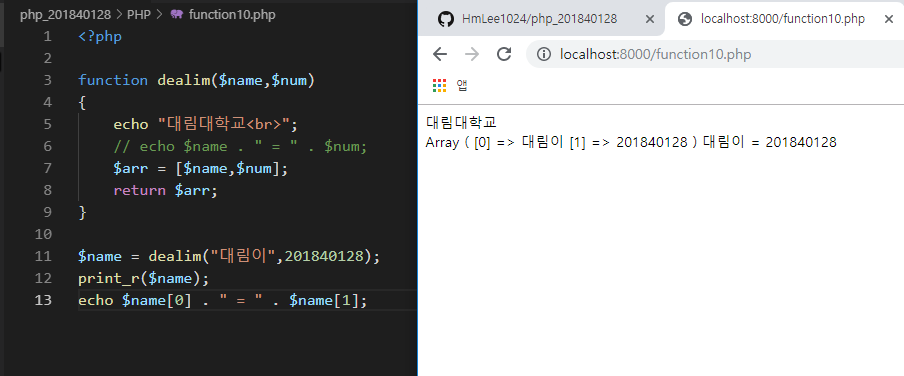
array 배열이용하여출력

## -13-
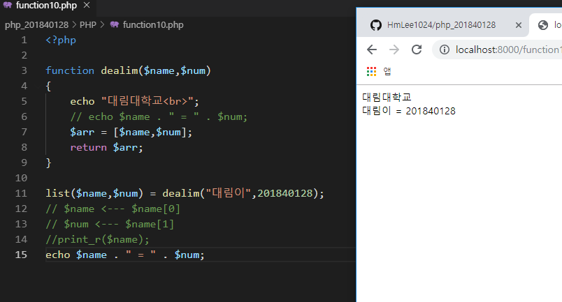
list 이용하여 출력

## -14-
.PNG)
include에 대해서

## -15-
여러개의 인클루드를 호출해도 한번만 실행된다.PNG)
include_once 여러개의 인클루드를 호출해도 한번만 실행된다

## -16-
.PNG)
include_once (2)

## -17-
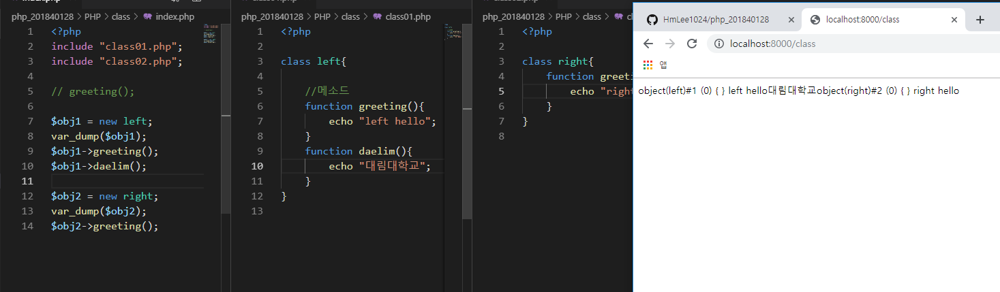
여러개의 메소드를 클래스안에 정의할 수 있다.

## -18-
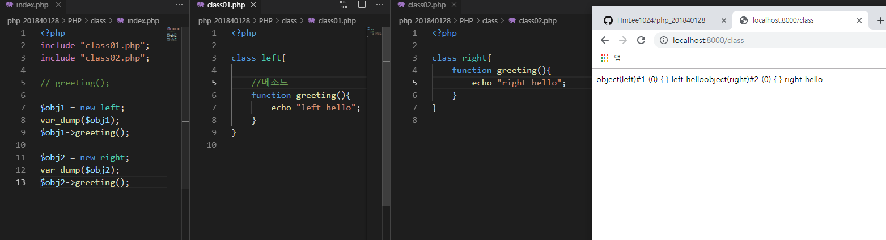
클래스의 정의와 호출