# 2019.10.23 PHP 리포트

## 수업내용정리

### -1-
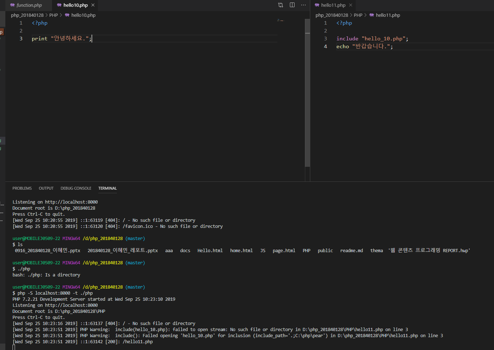  
localhost가 not found로 나오는 이유

### -2-
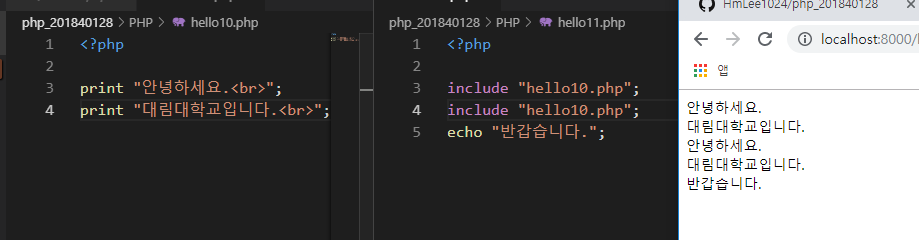  
include 소스가 몇줄이 되었든 다 집어 넣는다.

### -3-
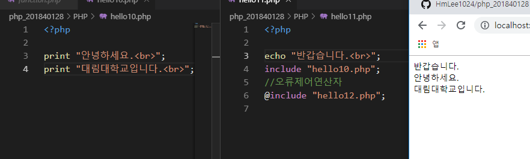  
오류제어연산자 include 오류가나도 실행됨

### -4-
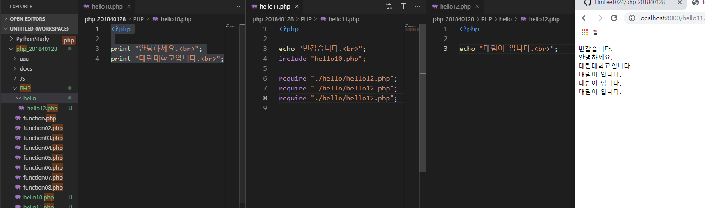  
require 경로지정

### -5-
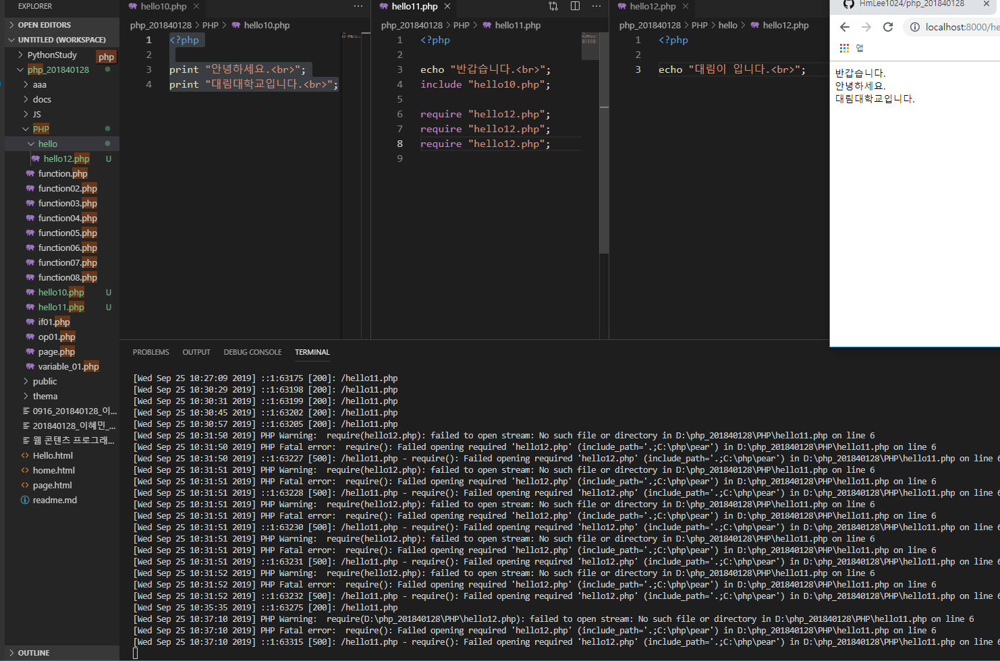  
require 파일경로가 달라도 실행중단됨

### -6-
  
4_require 파일이 없으면 실행이 중단된다. Falid 됨

### -7-
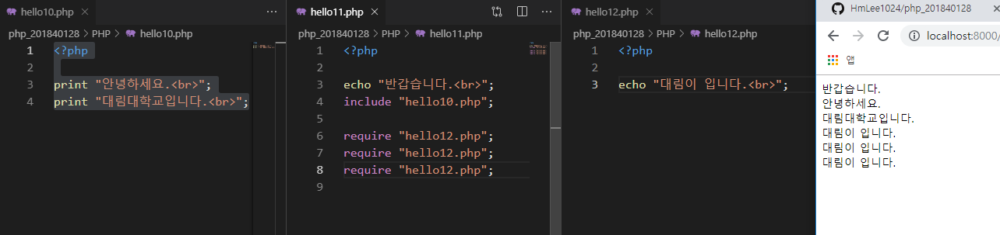  
require 파일이있으면 실행

### -8-
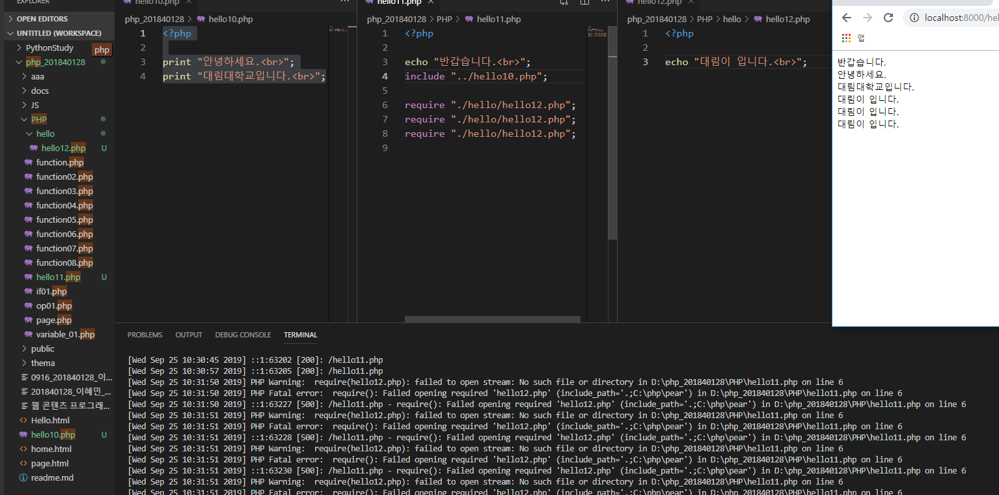  
경로지정 한다.

### -9-
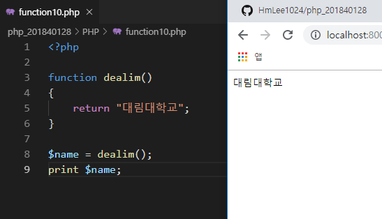  
return으로 값 저장시키고 출력

### -10-
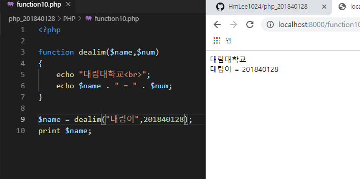  
변수값 출력

### -11-
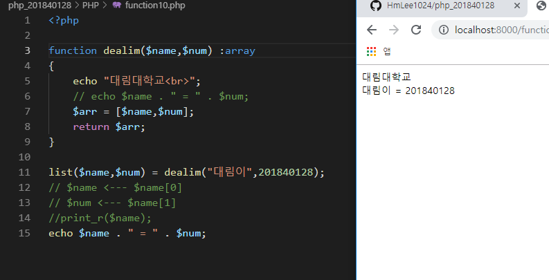  
변수타입지정

### -12-
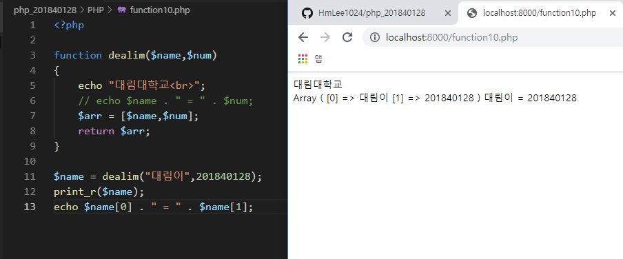  
array 배열이용하여출력

### -13-
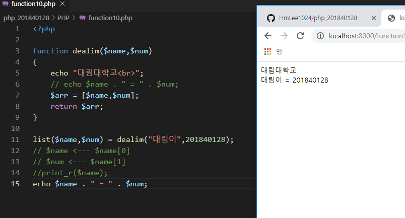  
list 이용하여 출력

### -14-
.PNG)  
include에 대해서

### -15-
여러개의 인클루드를 호출해도 한번만 실행된다.PNG)  
include_once 여러개의 인클루드를 호출해도 한번만 실행된다

### -16-
.PNG)  
include_once (2)

### -17-
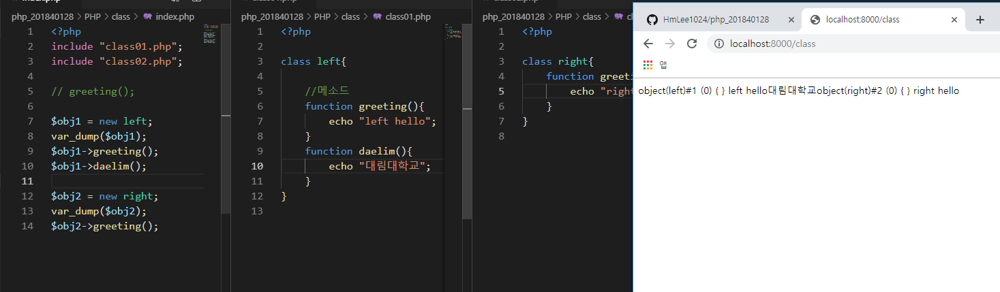  
여러개의 메소드를 클래스안에 정의할 수 있다.

### -18-
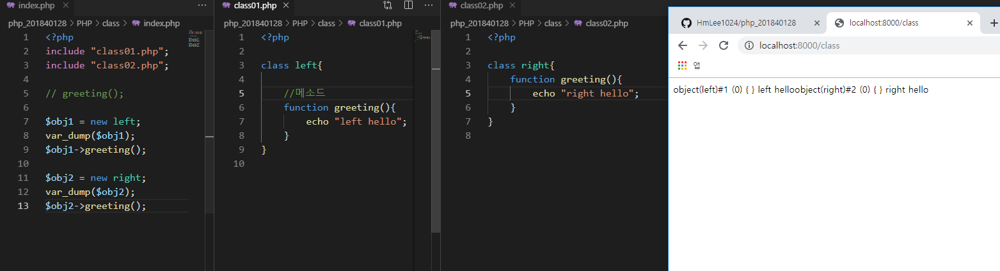  
클래스의 정의와 호출