# 2019.10.23 PHP 리포트

## 수업내용정리

### -1-
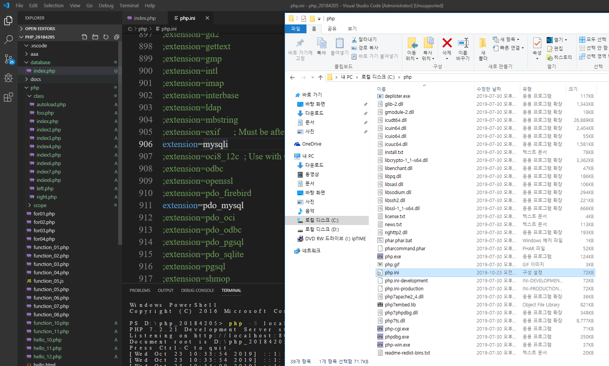  
database연동을 위한 작업이다.

### -2-
  
주석 뻬고 다시 서버 시작하면 활성화 된다.

### -3-
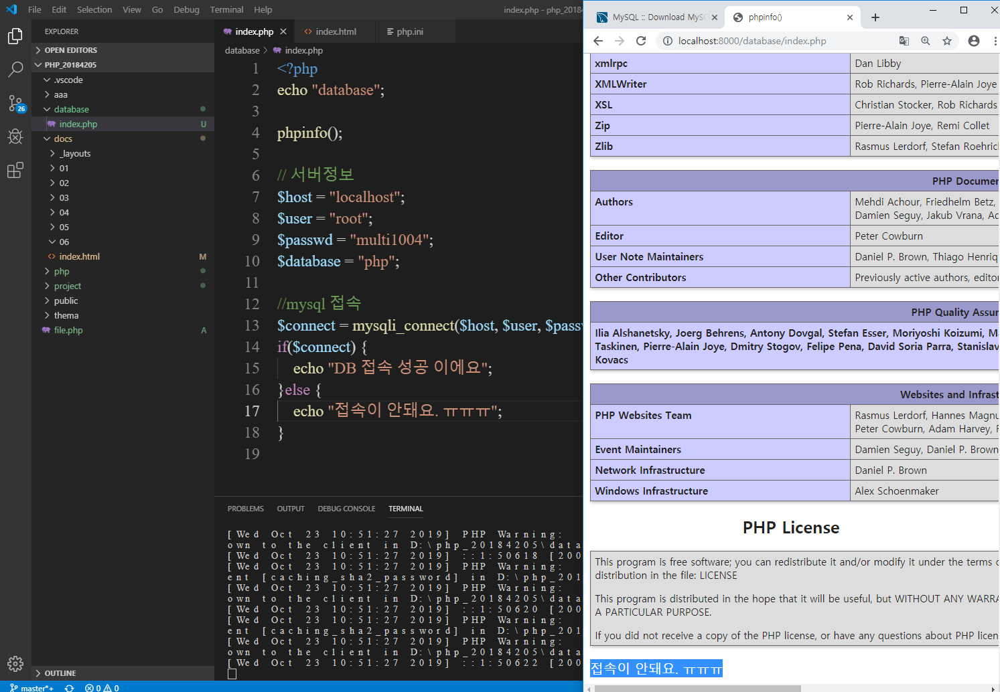  
접속이 안됩니다.

### -4-
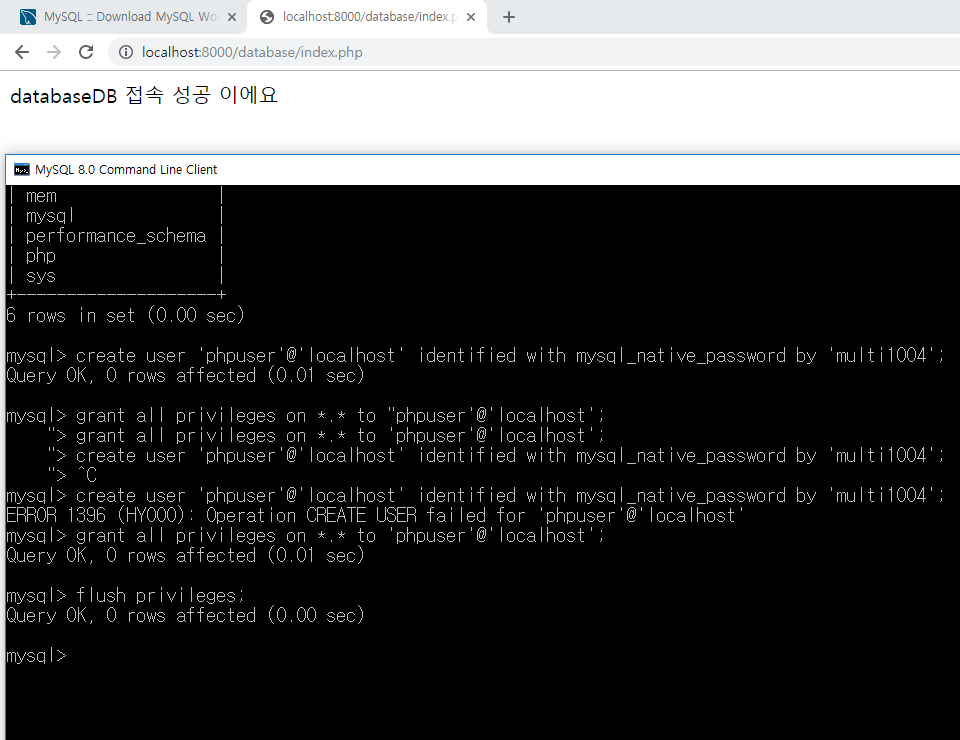  
보강입니다.

### -5-
  
db연동하기

### -6-
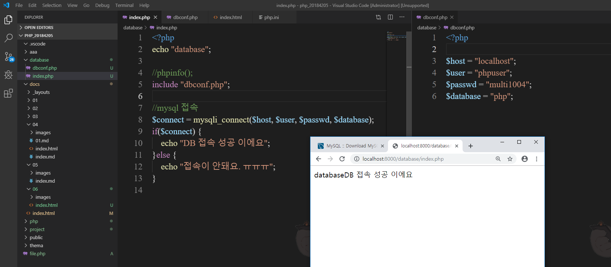  
include하기

### -7-
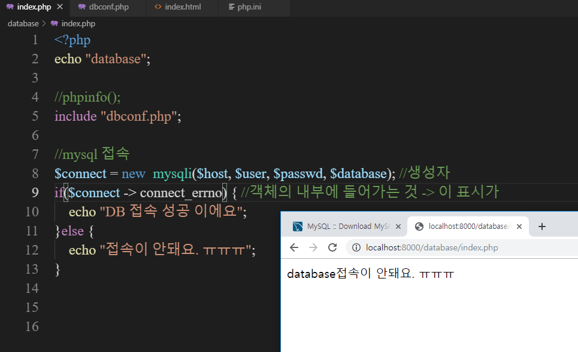  
! 사용하는가 사용하지 않는가.

### -8-
  
connect_errno 활용하기

### -9-
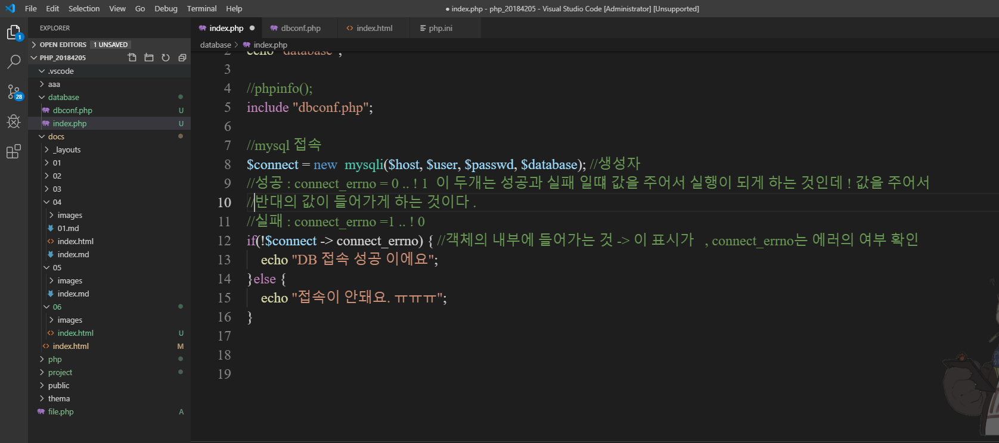  
성공과 실패입니다.

### -10-
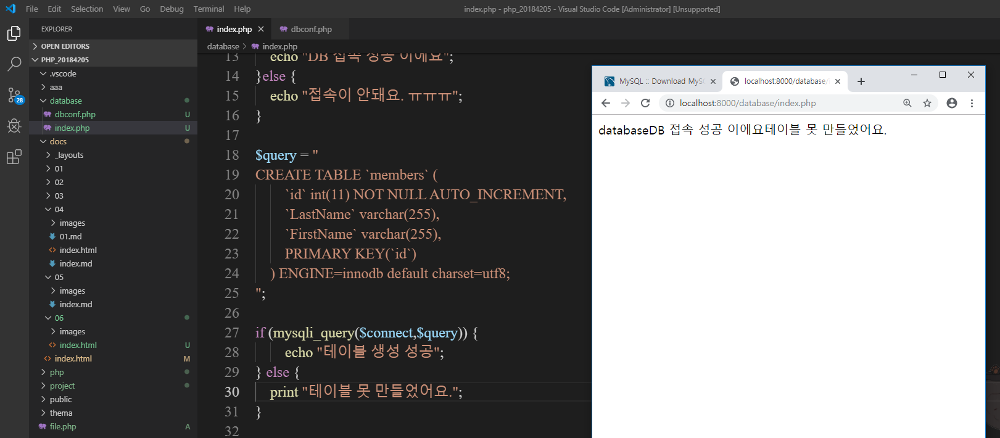  
vs안에 테이블 만들기

### -11-
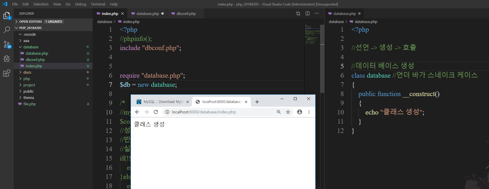  
클래스 생성할 때 

### -12-
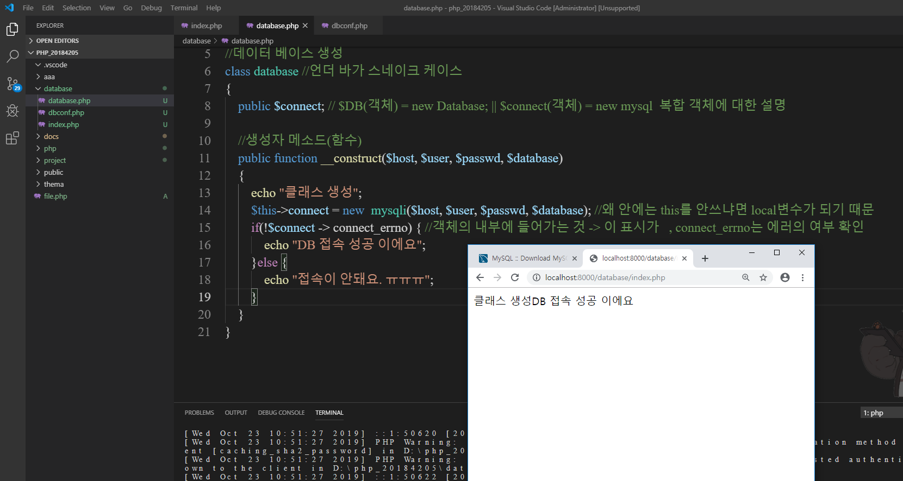  
클래스 생성과 db접속한다.

### -13-
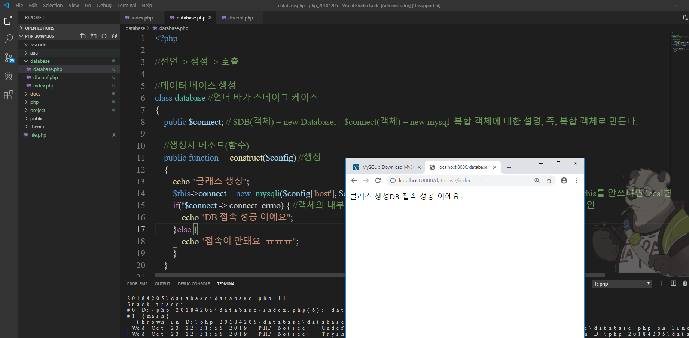  
복합 객체 사용

### -14-
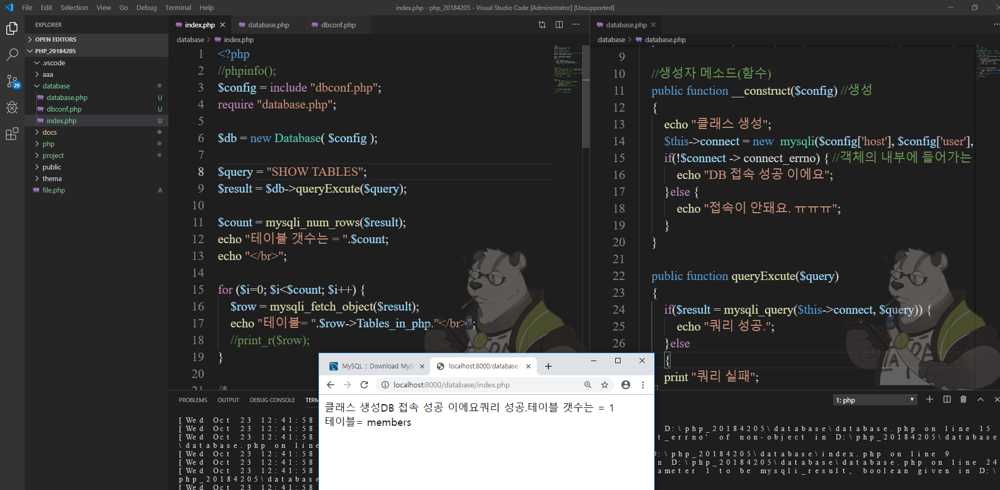  
테이블 갯수

### -15-
  
쿼리 생성과 테이블의 유무

### -16-
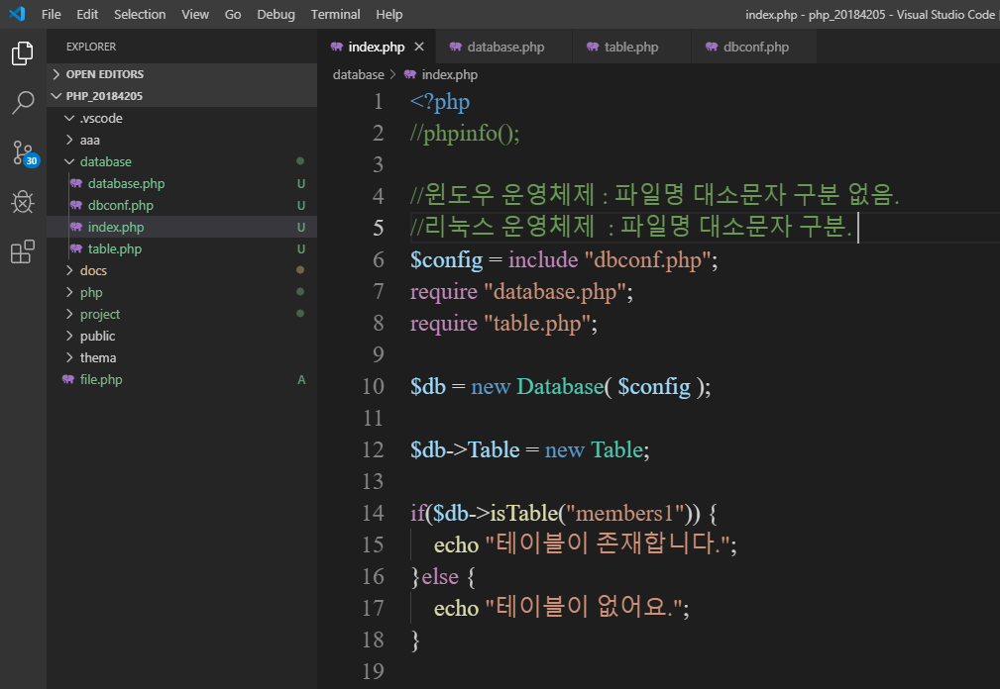  
파일명 구분

### -17-
  
테이블 클래스 생성하기

### -18-
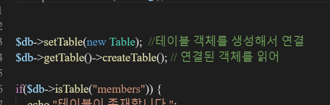  
getter setter 사용하기

### -19-
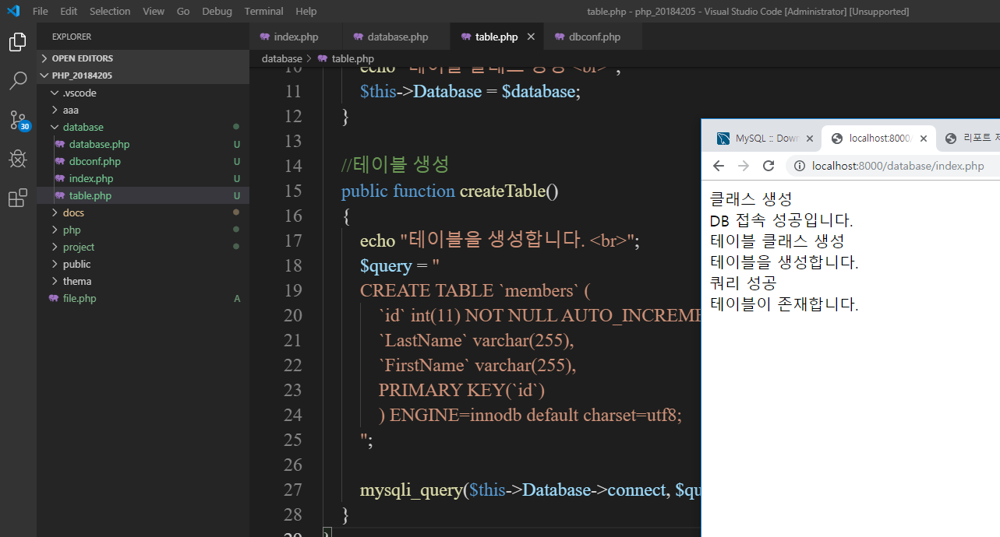  
성공

### -20-
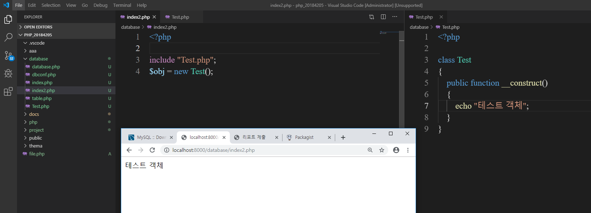  
테스트 객체

### -21-
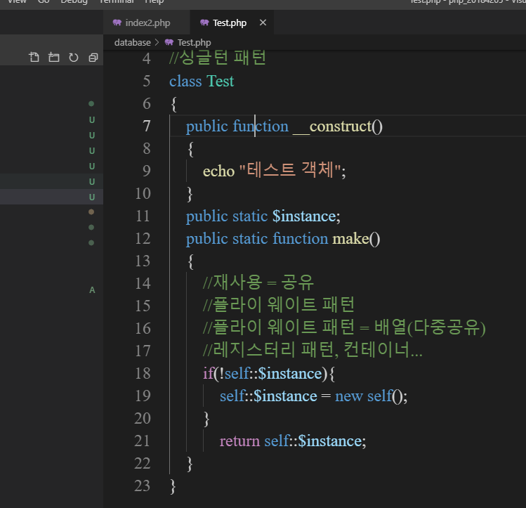  
프로그램의 다양한 패턴

### -22-
  
팩토리 패턴 