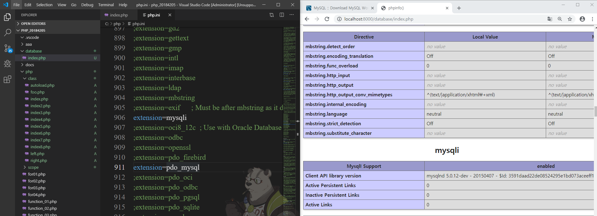
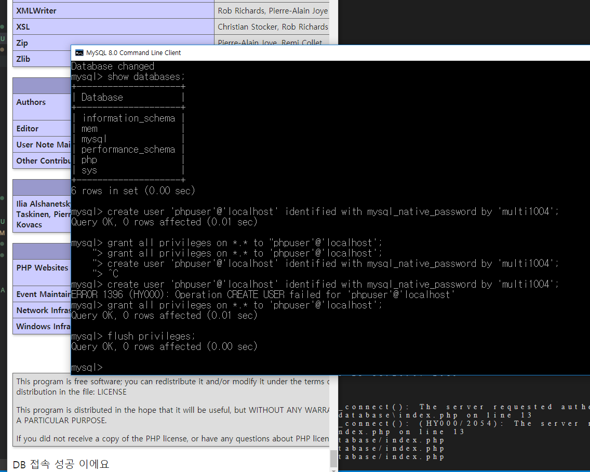
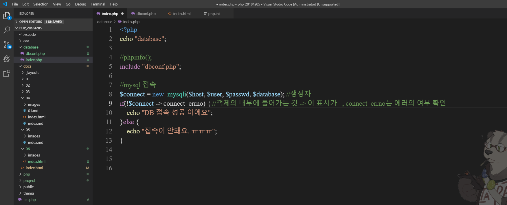
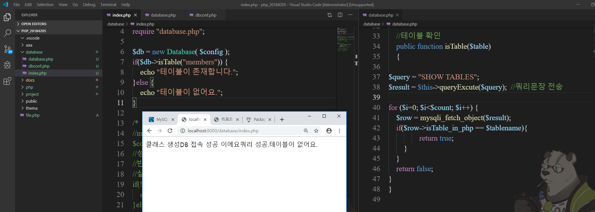

# 2019.10.23 PHP 리포트

## 수업내용정리

### -1-
database연동을 위한 작업이다.
  

### -2-
주석 뻬고 다시 서버 시작하면 활성화 된다.
  

### -3-
접속이 안됩니다.
  

### -4-
보강입니다.
  

### -5-
db연동하기
  

### -6-
include하기
  

### -7-
! 사용하는가 사용하지 않는가.
  

### -8-
connect_errno 활용하기
  

### -9-
성공과 실패입니다.
  

### -10-
vs안에 테이블 만들기
  

### -11-
클래스 생성할 때
  
 

### -12-
클래스 생성과 db접속한다.
  

### -13-
복합 객체 사용
  

### -14-
테이블 갯수
  

### -15-
쿼리 생성과 테이블의 유무
  

### -16-
파일명 구분
  

### -17-
테이블 클래스 생성하기
  

### -18-
getter setter 사용하기
  

### -19-
성공
  

### -20-
테스트 객체
  

### -21-
프로그램의 다양한 패턴
  

### -22-
팩토리 패턴
  
