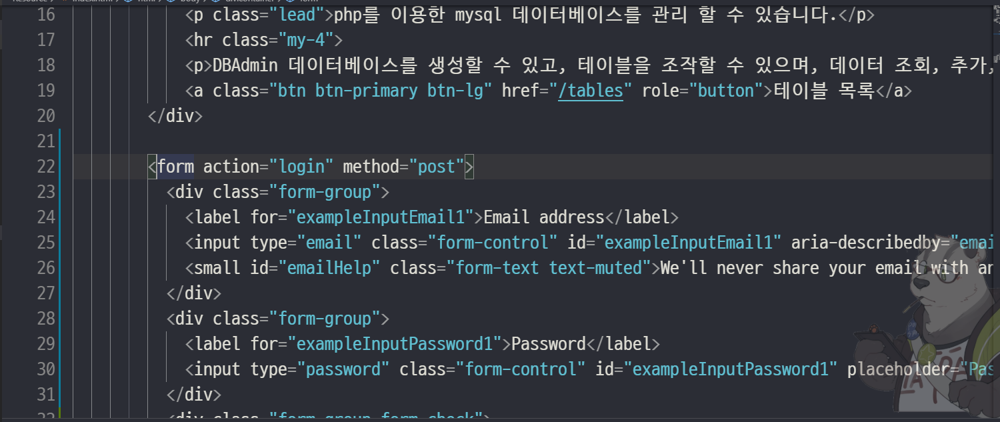

# 2019.11.20 PHP 리포트

## 수업내용정리

### -1-
  

### -2-
추가하기
  

### -3-
새파일 생성
  

### -4-
로그인 체크
  

### -5-
로그인
  

### -6-
로그인창
  

### -7-
로그인 성공
  

### -8-
로그인 하면 페이지이동
  

### -9-
버큰 클릭 추가
  

### -10-
데이터 베이스 생성함
  

### -11-
새로운 데이터 베이스 생성
  
 

### -12-
컬럼 추가
  

### -13-
컬럼명을 입력해 주세요
  

### -14-
데이터 타입
  

### -15-
테이블 삭제 추가
  
